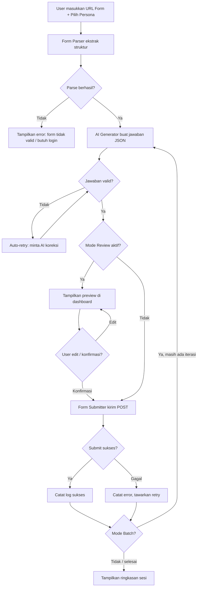
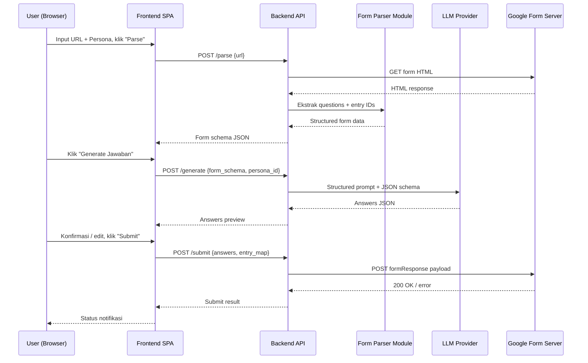
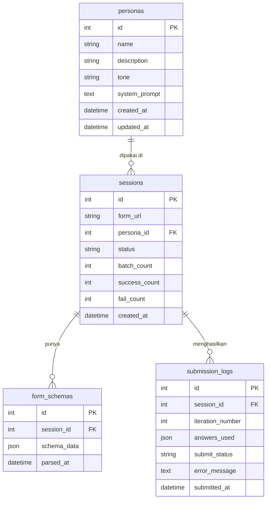

# PRD - Vareva AutoGF

## 1. Overview

**Vareva AutoGF** adalah web application yang mengotomatisasi pengisian Google Form menggunakan kecerdasan buatan. Pengguna cukup memasukkan URL form dan konteks persona, lalu sistem akan mengekstrak struktur form, membuat jawaban via LLM, dan mengirimkan respons secara otomatis.

Problem yang diselesaikan: pengisian form berulang secara manual memakan waktu dan rentan inkonsistensi — terutama untuk keperluan riset, load testing, atau pembuatan data dummy. Tool ini menghilangkan kebutuhan intervensi manusia untuk setiap pengisian.

**Target pengguna v1:** developer, researcher, dan QA engineer yang butuh mengisi Google Form publik (tanpa login) secara otomatis, baik sekali kirim maupun batch.

---

## 2. Requirements

- **Accessibility:** web app berbasis browser, desktop-first, responsive minimal
- **Users:** single-user (lokal/self-hosted) atau multi-user dengan autentikasi sederhana
- **Authentication:** opsional — email/password atau tanpa auth untuk self-hosted
- **Data Input:** URL Google Form + teks persona dari user; LLM API key via konfigurasi
- **Data Specificity:** setiap sesi pengisian menyimpan URL, persona, jawaban AI, status submit, timestamp
- **Notifications:** in-app (status submit sukses/gagal); tidak perlu email/push untuk v1
- **Localization:** tidak diperlukan v1; antarmuka dalam Bahasa Indonesia atau Inggris

---

## 3. Core Features

1. **Form Parser (Dynamic Extractor)**
   - Mengunduh HTML Google Form publik dan mengekstrak semua pertanyaan
   - Mendukung tipe: Short Answer, Paragraph, Multiple Choice, Checkboxes, Dropdown, Linear Scale, Grid
   - Mengekstrak `entry.XXXXXX` ID untuk setiap pertanyaan

2. **Persona Manager**
   - Pengguna dapat membuat, menyimpan, dan memilih profil persona (nama, usia, profesi, tone bahasa, preferensi opini)
   - Persona dikirim sebagai bagian dari sistem prompt ke LLM

3. **AI Answer Generator**
   - Menyusun semua pertanyaan + aturan form + persona menjadi satu structured prompt
   - Memanggil LLM (OpenAI / Gemini / model lain) dan meminta output JSON
   - Auto-retry jika jawaban AI tidak valid (halusinasi pilihan yang tidak ada)

4. **Human-in-the-Loop Review Mode**
   - Sebelum submit, menampilkan preview semua jawaban AI di dashboard
   - Pengguna dapat mengedit jawaban individual sebelum dikirim
   - Toggle: "Auto-submit" vs "Review dulu"

5. **Form Submitter**
   - Mengirim payload via HTTP POST ke URL `formResponse` Google Form
   - Menyertakan User-Agent header, random delay, dan cookie management (anti-bot dasar)
   - Mencatat hasil submit (sukses/gagal) beserta timestamp

6. **Batch Submission**
   - Menjalankan siklus Parser → Generator → Submitter sebanyak N kali
   - Setiap iterasi menggunakan variasi jawaban berbeda (random seed per iterasi)
   - Configurable delay antar submit untuk menghindari rate-limit

---

## 4. User Flow

---

## 5. Architecture

Frontend web app (SPA) berkomunikasi dengan backend service yang menangani parsing, AI call, dan submission. Backend perlu proxy request ke Google Form karena CORS.

---

## 6. Database Schema

| Table | Description |
|---|---|
| **personas** | Profil persona AI yang disimpan pengguna |
| **sessions** | Satu sesi pengisian form (bisa single atau batch) |
| **form_schemas** | Hasil parsing struktur form per sesi |
| **submission_logs** | Log tiap iterasi submit beserta jawaban dan status |

---

## 7. Design & Technical Constraints

1. **High-Level Technology:**
   - **Frontend:** modern web framework (React/Vue/Svelte), state management, UI component library
   - **Backend:** Python (FastAPI/Flask) atau Node.js — harus bisa menjalankan HTTP request ke Google Form dan memanggil LLM API
   - **Database:** SQLite untuk self-hosted single-user; PostgreSQL jika multi-user
   - **LLM Integration:** abstraksi provider agar mudah ganti antara OpenAI, Gemini, Anthropic
   - **Parser Strategy:** raw HTTP GET + HTML parsing (BeautifulSoup / cheerio) untuk form publik; Playwright/Puppeteer sebagai fallback untuk form dengan JS rendering

2. **Anti-Bot Constraints:**
   - Random delay 2–10 detik antar submit pada batch mode
   - Rotasi User-Agent string
   - Tidak mendukung form yang memerlukan Google login (out of scope v1)

3. **LLM Prompt Contract:**
   - Output wajib JSON dengan key = `entry.XXXXXX`
   - Validasi: jawaban pilihan ganda harus exact match salah satu opsi yang tersedia
   - Max retry loop: 3x sebelum sesi dianggap gagal

---

## 8. Out of Scope (v1)

- Form dengan Google Sign-In / login wajib
- File upload questions
- Multi-page form dengan logic branching kompleks
- Ekspor laporan ke CSV/Excel
- Scheduling / cron job submission
- Mobile app

---

## 9. Risks & Mitigations

| Risk | Likelihood | Mitigation |
|---|---|---|
| Google memperbarui struktur HTML form | Tinggi | Pisahkan parser sebagai modul terpisah; buat test fixture dari sample form |
| LLM hallucinate jawaban invalid | Sedang | Auto-retry + validasi ketat sebelum submit |
| Google rate-limit / blokir IP | Sedang | Random delay, User-Agent rotation, dokumentasikan batasan ke user |
| LLM API cost tidak terkontrol pada batch besar | Rendah | Tampilkan estimasi token/cost sebelum batch berjalan |

---

## 10. Future Roadmap

- Support form dengan login via cookie injection (session import dari browser)
- Ekspor submission log ke CSV
- Scheduling otomatis (cron)
- Plugin/extension browser untuk parsing form yang butuh JS rendering
- Dashboard analytics (distribusi jawaban, success rate)
