# Vareva AutoGF

<p align="center">
  <strong>AI-powered Google Forms automation with realistic Indonesian personas, review mode, live provider logs, and exportable batch results.</strong>
</p>

<p align="center">
  
  
  
  
  
</p>

---

## Overview

Vareva AutoGF is a full-stack tool for parsing public Google Forms, generating realistic Indonesian personas and answers with AI, then either submitting automatically or letting the user review and edit answers first.

It is designed around three goals:

- **Realistic Indonesian data** — gender-aware local names, natural occupations, cities, habits, and persona context.
- **Low-token AI generation** — compact prompts, per-form answer history, local validation, and local-only similarity warnings.
- **Operator-friendly workflow** — live SSE logs, provider fallback visibility, review UX, CSV/JSON/Excel export, and responsive neobrutalist UI.

> Use responsibly. Only submit to forms you own, administer, or are authorized to test.

## Key Features

### AI generation

- Multi-provider AI fallback chain:
  1. Gemini
  2. Groq
  3. Cerebras
  4. OpenRouter
  5. Static fallback as last resort
- Context-aware persona generation from parsed form topic and target audience.
- Compact prompts to reduce token usage without removing features.
- Form option validation and retry for invalid JSON/invalid answer options.
- Per-form answer history included before generation to reduce duplicate answer combinations.
- Local-only answer similarity warning after generation, with no extra AI call.

### Indonesian persona quality

- Large curated Indonesian name bank.
- Gender-matched name generation.
- Weighted common names for more natural output.
- Per-form blocked names to avoid reusing generated names on the same form/link.
- Guards against awkward gender/name pairings like `Fitri Irawan`, `Andi Ghina Lestari`, and `Rizky Lestari`.
- Occupation whitelist to avoid overly specific occupations like `Freelancer Digital Marketing`.

### Google Forms support

- Parse Google Forms from `FB_PUBLIC_LOAD_DATA_`.
- Extract fields, options, required flags, page breaks, and form metadata.
- Handle multi-page forms.
- Handle `Other` / `Yang lain:` option through Google Forms' special payload format.
- Resolve short `forms.gle` URLs before submission.

### Frontend UX

- Neobrutalism + pixel-art interface.
- Auto mode: generate and submit directly.
- Review mode: inspect and edit answers before submitting.
- Scrollable real-time system log via Server-Sent Events.
- Current AI provider badge during generation.
- Animated submit progress.
- Review warnings for suspicious answers.
- Batch result export to CSV, JSON, and Excel-compatible `.xls`.

## Screens / UX Highlights

- Setup screen with form URL, persona count, and mode selection.
- Loading screen with live system logs and AI provider status.
- Review screen with per-persona answer cards and warning highlights.
- Result screen with success rate, per-persona details, terminal log, and exports.

Add screenshots to a `docs/assets/` folder if you want GitHub visitors to see the UI immediately.

## Tech Stack

| Layer | Stack |
|---|---|
| Backend | FastAPI 0.136, SQLModel 0.0.38, Pydantic, SQLite |
| AI SDK | OpenAI SDK 2.37 with multiple OpenAI-compatible providers |
| HTTP | httpx with HTTP/2 |
| Frontend | React 19, Vite 8, TypeScript 6 |
| Styling | Tailwind CSS 4, Radix UI, shadcn-style primitives |
| Icons | Lucide React + custom SVG pixel art |
| Tests | pytest + pytest-asyncio |

## Quick Start

### 1. Clone

```powershell
git clone https://github.com/rapoii/Vareva-AutoGF.git
Set-Location Vareva-AutoGF
```

### 2. Backend setup

```powershell
Set-Location backend
py -3.12 -m venv .venv
.\.venv\Scripts\python.exe -m pip install -r requirements.txt
Copy-Item .env.example .env
```

Edit `backend/.env` and add at least one provider key:

```env
GEMINI_API_KEY=your_key
GROQ_API_KEY=your_key
CEREBRAS_API_KEY=your_key
OPENROUTER_API_KEY=your_key
DATABASE_URL=sqlite:///gform.db
LLM_MAX_RETRIES=3
DEBUG=false
```

### 3. Frontend setup

```powershell
Set-Location ..\frontend
npm install
```

### 4. Run development server

From the repository root:

```powershell
.\dev.ps1
```

This opens:

- Backend: `http://127.0.0.1:8000`
- Frontend: `http://127.0.0.1:5173`
- API docs: `http://127.0.0.1:8000/docs`

Manual mode:

```powershell
# Terminal 1
Set-Location backend
.\.venv\Scripts\python.exe -m uvicorn app.main:app --reload --host 127.0.0.1 --port 8000

# Terminal 2
Set-Location frontend
npm run dev -- --host 127.0.0.1 --port 5173 --strictPort
```

## How It Works

```mermaid
flowchart LR
  A[User enters Google Form URL] --> B[Backend parses form]
  B --> C[Infer form context and audience]
  C --> D[Load per-form answer/name history]
  D --> E[Generate personas with blocked names]
  E --> F[Generate answers with compact history prompt]
  F --> G[Validate JSON and form options]
  G --> H[Local similarity warning]
  H --> I{Mode}
  I -->|Review| J[User edits answers]
  I -->|Auto| K[Submit to Google Forms]
  J --> K
  K --> L[Save logs and show/export results]
```



## API Endpoints

| Method | Endpoint | Description |
|---|---|---|
| `GET` | `/` | Health check |
| `POST` | `/api/parse/` | Parse Google Form URL into schema |
| `POST` | `/api/generate/` | Generate personas and answers |
| `POST` | `/api/submit/` | Submit a single answer payload |
| `POST` | `/api/batch/run` | Batch parse → generate → submit; streams when requested |
| `POST` | `/api/batch/run-stream` | Dedicated SSE batch pipeline |
| `POST` | `/api/personas/` | Create persona profile |
| `GET` | `/api/personas/` | List persona profiles |
| `GET` | `/api/personas/{id}` | Read persona profile |
| `PATCH` | `/api/personas/{id}` | Update persona profile |
| `DELETE` | `/api/personas/{id}` | Delete persona profile |

See [docs/API.md](docs/API.md) for request examples and SSE events.

## Testing

Run all backend tests:

```powershell
& "backend\.venv\Scripts\python.exe" -m pytest "backend\tests"
```

Run focused quality/name tests:

```powershell
& "backend\.venv\Scripts\python.exe" -m pytest "backend\tests\test_quality.py" "backend\tests\test_indonesian_names.py"
```

Frontend build:

```powershell
Set-Location frontend
npm run build
```

## Project Structure

```text
v2/
├── backend/
│   ├── app/
│   │   ├── core/          # parser, generator, submitter, quality checks
│   │   ├── data/          # Indonesian name bank
│   │   ├── models/        # SQLModel tables
│   │   ├── routes/        # FastAPI routes
│   │   └── schemas/       # Pydantic schemas
│   ├── tests/             # pytest suite
│   └── requirements.txt
├── frontend/
│   ├── src/
│   │   ├── components/    # step UI, pixel art, primitives
│   │   ├── hooks/         # React action helpers
│   │   └── lib/           # API client, export helpers, review quality
│   └── package.json
├── docs/                  # project documentation
├── CLAUDE.md              # AI assistant project guide
├── PLAN.md                # implementation plan/history
├── dev.ps1                # one-command dev runner
└── README.md
```

## Documentation

- [Architecture](docs/ARCHITECTURE.md)
- [API Reference](docs/API.md)
- [Environment Variables](docs/ENVIRONMENT.md)
- [Development Guide](docs/DEVELOPMENT.md)
- [Production Notes](docs/PRODUCTION.md)

## Production Notes

Before deploying:

- Restrict CORS origins.
- Configure provider API keys through platform secrets.
- Do not log PII unless explicitly needed and protected.
- Move from SQLite to a managed database if multiple instances/users are expected.
- Add authentication/authorization if exposed beyond personal/internal use.
- Add rate limiting and abuse protection.
- Review Google Forms usage policy and only automate authorized forms.

## Security & Privacy

- `.env`, local databases, and virtual environments are ignored by Git.
- Form URLs are user-provided and validated at backend boundaries.
- Names and answers may be PII-like data; avoid exposing logs publicly.
- This tool should be used for owned forms, internal QA, demos, or authorized testing.

## License

Add a license before publishing if you want others to use or contribute to the project.
