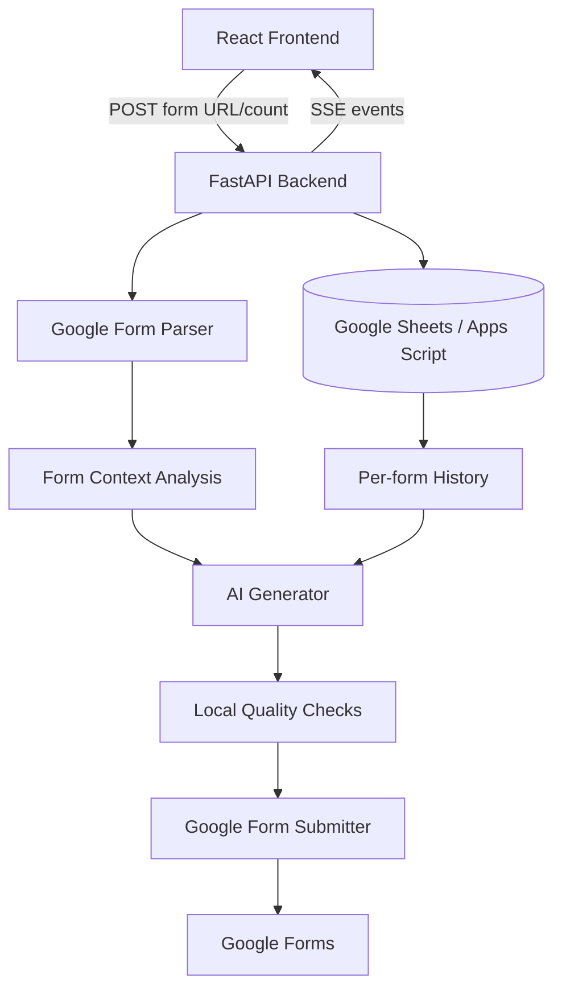

# Architecture

Vareva AutoGF is a FastAPI + React application for parsing Google Forms, generating Indonesian personas and answers with AI, and submitting or reviewing the result.

## High-level Flow



## Backend Components

### Parser

`backend/app/core/parser.py`

- Fetches Google Forms HTML.
- Extracts `FB_PUBLIC_LOAD_DATA_`.
- Builds a `FormSchema` with fields, options, required flags, and pages.
- Detects `Other` / `Yang lain:` options.
- Infers context and target audience for persona generation.

### Generator

`backend/app/core/generator.py`

- Builds compact prompts to minimize token usage.
- Uses a multi-provider chain: Gemini → Groq → Cerebras → OpenRouter.
- Generates personas using preassigned Indonesian names from the backend name bank.
- Generates answers using compact form schema and compact per-form answer history.
- Retries only when the AI output is invalid JSON or invalid against form options.
- Does not retry AI only because answers are similar.

### Quality

`backend/app/core/quality.py`

- Checks answer similarity locally with no token usage.
- Ignores identity fields such as name, age, gender, and occupation when comparing uniqueness.
- Validates persona quality with occupation whitelist, age sanity checks, and gender/name warnings.
- Quality warnings are non-blocking by default.

### Submitter

`backend/app/core/submitter.py`

- Builds Google Forms submission payloads.
- Supports single-page and multi-page forms.
- Resolves short links like `forms.gle`.
- Converts `Yang lain:` to Google Forms' `__other_option__` format.

## Data Model

| Sheet | Purpose |
|---|---|
| `users` | Auth profiles and password hashes |
| `sessions` | Batch submission sessions |
| `form_schemas` | Cached parsed form schema per session |
| `generation_configs` | Durable generation instructions/config per session |
| `submission_logs` | Answers and submit status per iteration |
| `generated_persona_logs` | Used generated persona names per form URL |

## Per-form History Strategy

For repeated submissions to the same form URL:

1. Load recent sessions for the same `form_url`.
2. Load previous `submission_logs.answers_json` for those sessions.
3. Load previously generated persona names from `generated_persona_logs`.
4. Generate new personas with `blocked_names`.
5. Generate answers with compact prior answer history in the prompt.
6. Run local similarity warning after generation.
7. Append new answers to in-memory history so later personas in the same batch also avoid earlier ones.

## Frontend Architecture

`frontend/src/App.tsx` controls the app state machine:

```text
setup → scan config → confirm → generate progress → review submit → result
setup → scan config → confirm → generate progress → result
```

Important components:

| Component | Role |
|---|---|
| `BatchSetupStep` | URL/count/mode input and scan readiness gating |
| `ScanConfigStep` | Optional generation instructions and per-question custom answers |
| `BatchProgressStep` | Reload-safe saved-session progress, editable review answers, and review submit action |
| `LoadingOverlay` | Shared modal loading state over the current page |
| `BatchResultStep` | Result stats, per-persona details, export actions for legacy flows |

## Real-time Updates

The backend streams events from `/api/batch/run-stream` using Server-Sent Events:

- `log` — phase and message
- `provider` — active AI provider
- `iteration_result` — result per persona
- `complete` — final batch response
- `error` — terminal error

The frontend keeps recent log lines and renders them in a scrollable terminal-style panel.
